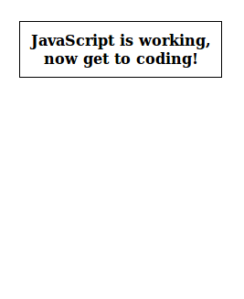





Today we will be making a classic analog clock using the canvas features of HTML5 (bonus points if you listen to any [appropriately][music1] [themed][music2] [music][music3] while making it). _NOTE: Is the music suggestion a bit too much? If not, I still need one more song._

[music1]: http://www.youtube.com/watch?v=d020hcWA_Wg  "Clocks by Coldplay"
[music2]: http://www.youtube.com/watch?v=LWTLUmUjo8A  "Time by Pink Floyd"
[music3]: {{ todo }}  "TODO"

<div class="tutorial-example">
	<canvas class="clock" id="tutorial-example-clock" width="200" height="200">
		If you can see this message, your browser does not support canvas, and needs an upate. Sorry. :(
	</canvas>
</div>

_NOTE: I'll probably remove this "You will learn" list, I just figured it might be a way for readers to skip ahead in the tutorial if they already know the first topics, yet it may prove more difficult following along if you don't start from the beginning._

You will learn:

 * How to use the `Date` class
 * How to format time the way you want it
 * How to draw angled lines on the canvas
 * How to use the `setInterval()` function
 * How to draw text to the canvas

## The Setup

If you want to follow along at home, [download the empty template as a ZIP]({{ page.download_url }}).

> **Do you know Git?** If you use Git, you can instead follow along by [forking this project on GitHub]({{ page.github_url }}) and starting in the `empty-project` branch.

If you downloaded the template, you can [skip to the next step]({{ next_url }}). Or if you prefer to write the files yourself, stick around.


### Doing it manually

First we need some HTML. The only HTML we will be using will look like this:

```html
<div id="currentTime">12:00:00 AM</div>
<canvas id="clock" width="200" height="200">
    If you can see this message, your browser does not support canvas, and needs an upate. Sorry. :(
</canvas>
```

> In order for browsers to display the page properly, you will need to surround that code with some more code such as `<html>` and `<body>` tags. In addition you need some way of loading the CSS and JavaScript. If you have played with HTML before, this should be easy; otherwise I would recommend checking out [this tutorial to help you get started]({{ todo }}).

Next, we need to make our existing elements look a bit fancier with some CSS:

```css
#currentTime {
    display: block;
    font-weight: bold;
    text-align: center;
    width: 200px;
    padding: 10px;
    border:1px solid #000000;
}

#clock {
    padding: 10px;
}
```

And finally, some JavaScript to make it all start moving!

```javascript
document.addEventListener('DOMContentLoaded', displayTime);
function displayTime()
{
	// Just to test if the JavaScript gets loaded in properly. You can remove this later!
	document.getElementById("currentTime").innerHTML = "JavaScript is working, now get to coding!";
}
```

If your page doesn't look like this, double check that you loaded in the JavaScript properly.






