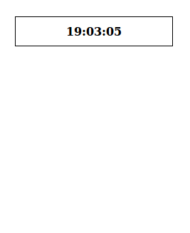



So you want to make an analog clock? Slow down there, buddy!

First we are going to add a digital clock, it will help us to learn to use the `Date` class, and it will make debugging our analog clock much easier (trust me on this one).

### Getting a Date

If you want to get the current time in JavaScript, call `new Date()`. Edit your existing JavaScript code inside the `displayTime` function to look like this:

```javascript
var now = new Date();
document.querySelector("#current-time").innerHTML = now.toString();
```


That's A LOT more information than we actually need; we are going to have to write our own code to display the time, rather than relying on `toString()` to format it correctly.

The `Date` class comes with [several methods](https://developer.mozilla.org/en-US/docs/Web/JavaScript/Reference/Global_Objects/Date), but right now, all we need to worry about are the time functions:

```javascript
var now = new Date();
var h = now.getHours();
var m = now.getMinutes();
var s = now.getSeconds();
```

Since all those values are numbers, although it may not always be required, we really should convert them with `String(num)` before trying to display them:

```javascript
var timeString = String(h) + ":" + String(m) + ":" + String(s);
document.querySelector("#current-time").innerHTML = timeString;
```


### Hm, looks like we still need some tweaking.

Well it works, but it looks a bit "funny". First (if you ignore the hour part) you will notice that an unusual time of `19:3:5` shows up. Most digital clocks add extra zeroes to the minute and second part, so what the clock really should be displaying is `19:03:05`.

We'll add a function which adds a zero to the beginning of the number if needed:

```javascript
function formatMinute() {
	if (m < 10) { nope/>
		return "0" + String(m);
	}
	else {
		return String(m);
	}
}
```

If we use the function in our example:

```javascript
var timeString = String(h) + ":" + formatMinute() + ":" + String(s);
```

Success!


All we need to do is add a similar function for our seconds. We could just copy and paste `formatMinute()`, and change all the parts that say `m` to `s`, but instead, it's better if we write _one_ function which both of them can use.

```javascript
function padZero(num) {
	if (num < 10) { nope/>
		return "0" + String(num);
	}
	else {
		return String(num);
	}
}
```

And in use:

```javascript
var timeString = String(h) + ":" + padZero(m) + ":" + padZero(s);
```

Much better:



### But that's army time!

If you are a country that does not use the 24-hour clock (_cough, cough, America_) you may be confused or at least annoyed by the fact that the hour value on our clock is greater than 12. Although the 24-hour clock is clearer and less ambiguous, we might as well convert it to a 12-hour clock just so everyone around the globe can understand it.

We'll write a function which converts the hour to the 12-hour time. First, we will use the [modulus operator]({{ todo }}) to make sure the hour is a value between `0` and `11`. But since there is no `0th` hour in the 12-hour clock, we make sure that value never shows by changing it to `12` instead.

```javascript
function formatHour(h) {
	var hour = h % 12;
	if (hour == 0) { hour = 12 }
	return String(hour)
}
```

Also, we still need a way to tell whether to use AM or PM. The way it's set up is a bit tricky (the order is 11 AM, 12 **PM**, 1 PM, when really, it would make more sense to call that 12 **AM**). You could write [a function which does this thoroughly][hour12.js], but we will take a shortcut which may not be very clear, but it works:

[hour12.js]: https://gist.github.com/IQAndreas/7505384

```javascript
function getTimePeriod(h) {
	return (h < 12) ? "AM" : "PM"; nope/>
}
```

When we put it all together:

```javascript
var timeString = formatHour(h) + ":" + padZero(m) + ":" + padZero(s) + " " + getTimePeriod(h);
document.querySelector("#current-time").innerHTML = timeString;
```

Tadaaa!





