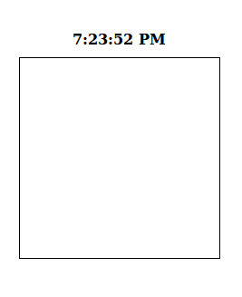
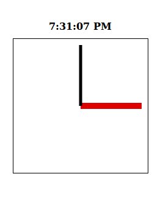
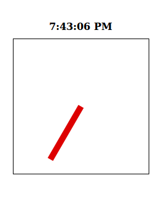
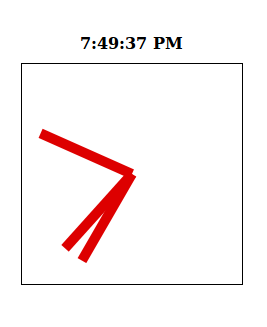
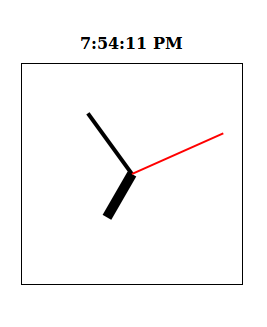





Here is where the fun begins! Remember that `<canvas>` element that has been waiting for us so patiently? It's a bit difficult to see where on the page it is, so let's "bring it forward" by moving our outline from the digital clock to our canvas.

```css
#current-time {
    display: block;
    font-weight: bold;
    text-align: center;
    width: 200px;
    padding: 10px;
}

#clock {
    padding: 10px;
    border:1px solid #000000;
}
```



There it is!


### Testing our canvas

Let's make sure our canvas is working properly by drawing a few lines on it. It will be handy to leave the digital clock there (that way we can see the current time above our analog clock), so just leave the old JavaScript where it is, and add the code for the analog clock right after it.

First we will make a red line from the center of the clock to the right (3 o'clock).

```javascript
// --- Analog clock ---//

var canvas = document.querySelector("#clock");
var context = canvas.getContext("2d");

// You can change this to make the clock as big or small as you want.
// Just remember to adjust the canvas size if necessary.
var clockRadius = 100;

// Make sure the clock is centered in the canvas
var clockX = canvas.width / 2;
var clockY = canvas.height / 2;

// <-- Put math here later nope/>

// The line should be 10 pixels thick, and red
context.lineWidth = 10;
context.strokeStyle = '#DD0000';

context.beginPath();
context.moveTo(clockX, clockY); // Start at the center
context.lineTo(clockX + clockRadius, clockY); // Draw a to the right
context.stroke();
```

Let's add a black line from the center to the top (12 o'clock). Note that we don't need to re-create the variables `canvas` or `context`, we can just re-use the ones we created for the red line.

Add this code right after your red line's code:

```javascript
// The line should be 5 pixels thick, and black
context.lineWidth = 5;
context.strokeStyle = '#000000';

context.beginPath();
context.moveTo(clockX, clockY); // Start at the center
context.lineTo(clockX, clockY - clockRadius); // Draw a line upwards
context.stroke();
```



Wohoo, it is now 3 o'clock every day; no school!

Even though this clock is guaranteed to be correct twice a day, it's still not practical enough for our purposes. We need more control over where those arms are pointing.


### Warning: Math ahead!

Alas, this part requires some trigonometry. The good news is, since there is already a great tutorial on [positioning items around a circle]({{ todo }}), rather than write the code from scratch, we will modify the code found in that tutorial. If you want a more detailed explanation of the math, I would recommend you read up on that tutorial, and the related [positioning items on a grid]({{ todo }}).

Let's remove the black arm for now, and just focus on rotating the red hour arm correctly. 

When the **hour** arm is pointing at `2` o'clock, it has gone `2/12 ths` of the way around the clock. So, at `2` o'clock, our hour hand is pointing to `TAU * (2/12)` radians. If we want to get this value automatically by code:

```javascript
var hArmRadians = Math.TAU * (h / 12);
```

Next we need to know the length of the arm; for now, we will make the arm as long as the clock's radius so that it points to the utmost edge of the clock. Now we just plug these numbers into the existing code.

Find the comment that says `Put math here`, and replace it with these lines of code:

```javascript
// Make sure TAU is defined (it's not by default)
Math.TAU = 2 * Math.PI;

var hArmRadians = Math.TAU * (h / 12);
var hArmLength = clockRadius;

// If we start from the center of the clock, 
//  this is where the x and y value the other end of the arm should point to
var targetX = clockX + Math.cos(hArmRadians - (Math.TAU/4)) * hArmLength;
var targetY = clockY + Math.sin(hArmRadians - (Math.TAU/4)) * hArmLength;
```

And now we draw it.

```javascript
context.lineWidth = 10;
context.strokeStyle = '#DD0000'; // RED

context.beginPath();
context.moveTo(clockX, clockY); // Start at the center
context.lineTo(targetX, targetY); // Draw a line outwards
context.stroke();
```

If everything is correct, you should see hour hand pointing to whatever hour it currently is when you are.



### Adding the other arms

Now, we could just copy and paste the code for displaying the `hour` hand, but edit it for the `minutes` and `seconds`, but that would take a lot of code, and wouldn't make us very good developers. Instead, we can put it all in a function which draws the arms for us.

```javascript
// Make sure TAU is defined (it's not by default)
Math.TAU = 2 * Math.PI;

function drawArm(progress) {
	var armRadians = (Math.TAU * progress) - (Math.TAU/4);
	var armLength = clockRadius;
	
	var targetX = clockX + Math.cos(armRadians) * armLength;
	var targetY = clockY + Math.sin(armRadians) * armLength;

	context.lineWidth = 10;
	context.strokeStyle = '#DD0000'; // RED

	context.beginPath();
	context.moveTo(clockX, clockY); // Start at the center
	context.lineTo(targetX, targetY); // Draw a line outwards
	context.stroke();
}
```

There is one **important** thing we need to keep in mind. Let's say the time is currently `3:10`; according to our code, the `hour` value is `3`, so it has traveled `3/12` around the clock (`TAU*(3/12)` radians). The `minute` value is `10`, but it has **not** traveled `10/12` around the clock! It has _only_ traveled `10/60` around the clock (`TAU*(10/60)` radians).

That is why instead of passing a the current value (like in the example, `3` for hour and `10` for minute) we are passing a value named `progress`, which represents how far along the clock the arm has traveled. A value of `0` means you are at noon, and `0.5` means you are pointing straight down at 6 o'clock, and a value of `0.25` means the arm is pointing to the very right at the three on the clock.

Finally, we add this code at the end to draw the arms.

```javascript
drawArm(h / 12); // Hour
drawArm(m / 60); // Minute
drawArm(s / 60); // Second
```



Well, we can see the arms, but they all look the same. Let's add some more parameters to our `drawArm()` function so we can tell the difference between them.

```javascript
// Make sure TAU is defined (it's not by default)
Math.TAU = 2 * Math.PI;

function drawArm(progress, armThickness, armLength, armColor) {
	var armRadians = (Math.TAU * progress) - (Math.TAU/4);
	var targetX = clockX + Math.cos(armRadians) * (armLength * clockRadius);
	var targetY = clockY + Math.sin(armRadians) * (armLength * clockRadius);

	context.lineWidth = armThickness;
	context.strokeStyle = armColor;

	context.beginPath();
	context.moveTo(clockX, clockY); // Start at the center
	context.lineTo(targetX, targetY); // Draw a line outwards
	context.stroke();
}
```

Similar to what we did above with `progress`, the parameter `armLength` can be a value from `0` to `1`. A value of `1` means it reaches all the way out to the edge of the clock, while a value of `0.5` means the stubby little thing only goes half way out. That way, even if we change the size of our clock, it won't mess up our arms.

Now you can customize your arms to your heart's content! _Extra credit: try setting it to negative values or values greater than `1` and see what fun can come out of it._

I wanted to stay as true to the "classic" clock look, so these are the colors and sizes that I chose:

```javascript
drawArm(h / 12, 10, 0.50, '#000000'); // Hour
drawArm(m / 60,  4, 0.75, '#000000'); // Minute
drawArm(s / 60,  2, 1.00, '#FF0000'); // Second
```

<div class="tutorial-example">
	<div class="currentTime" id="tutorial-example-currentTime">12:00:00 AM</div>
	<canvas class="clock" id="tutorial-example-clock" width="200" height="200">

	</canvas>
</div>

The clock looks great, but it's kind of... still... It's not <code id="tutorial-example-storedTime">7:54</code> any more, that's so <span id="tutorial-example-since">five minutes</span> ago.

Wouldn't it be great if the clock's hands moved on their own?




