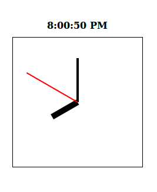
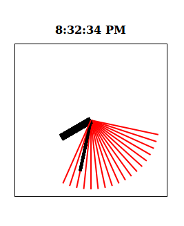





Here is how our clock looks so far.



It's nice, but a little too static for my taste.

### Please turn off all analog devices so they do not interfere with our equipment

For now, let's temporarily hide our analog clock and first make sure we can get our digital clock to automatically update. To do this, we can add a small `return` inside of the function where we want it to quit early.

```javascript
var timeString = formatHour(h) + ":" + padZero(m) + ":" + padZero(s) + " " + getTimePeriod(h);
document.querySelector("#current-time").innerHTML = timeString;

return; // exit early

// --- Analog clock ---//

var canvas = document.querySelector("#clock");
var context = canvas.getContext("2d");
```

Now the analog clock part of our code is disabled, yet still there for when we need it again.


### Making the digital clock move

Let's look at the first part of our code (the very beginning, which tells us to not draw the clock until the entire page has loaded).

```javascript
document.addEventListener('DOMContentLoaded', displayTime);
function displayTime() {
	var now = new Date();
	var h = now.getHours();
	var m = now.getMinutes();
	/* ... etc ... */
	/* ... lots of code here that has been cut out ... */
}
```

The page only loads **once**, which means our `displayTime()` function only gets run once. How would we go about running it again and again?

You may say, "let's just put it in a loop":

```javascript
document.addEventListener('DOMContentLoaded', displayTime);
function displayTime() {
	// Loop forever and ever and ever as fast as you can
	do {
		var now = new Date();
		var h = now.getHours();
		var m = now.getMinutes();
		/* ... etc ... */
		/* ... lots of code here that has been cut out ... */
	}
}
```

I applaud your ingenuity, but this is a horrible idea! The code will run tens of thousands of times a second, and may eventually spin out of control!

_You are welcome to try it, but it will start your CPU's fan running at full speed, and might even crash your browser! (don't worry, your browser won't break permanently, you will just have to restart it and might loose any unsaved work). But let's not do this._

Since clocks in the real world only update once a second, we don't need to update the clock more often than that. JavaScript has the perfect tool for this!

### Introducing `setInterval()`

The handy `setInterval()` function will run a function again and again, with a gap in between each call (making it much more performance friendly than looping the function thousands of times per second with no rest).

`setInterval` has two parameters, the function you want to run, and the number of milliseconds between each time you run it. One millisecond is `1/1000` of a second. If you want to run a function every `5 seconds` (`5000 milliseconds`), you would use the following code:

```javascript
setInterval(checkEmail, 5000);
```

That will cause JavaScript to act like this (notice that it starts by waiting):

```javascript
//wait 5 seconds
checkEmail();
//wait 5 seconds
checkEmail();
//wait 5 seconds
checkEmail();
//wait 5 seconds
checkEmail();
// ... to infinity!
```

If you want to stop `setInterval` from running, you need to keep track of the value that `setInterval` returns when you first start it, then pass that to `clearInterval`:

```javascript
var stopID = setInterval(checkEmail, 5000);

function checkEmail() {
	if (haveNewEmail) {
		// Stop checking our email
		clearInterval(stopID);
	}
	else {
		console.log("No new mail yet. I will check again in 5 seconds.")
		// Just let `setInterval()` keep checking again and again until there is new mail
	}
}
```

### Using `setInterval` with our clock

Let's look back at our original code.

```javascript
document.addEventListener('DOMContentLoaded', displayTime);
function displayTime() {
	var now = new Date();
	var h = now.getHours();
	var m = now.getMinutes();
	/* ... etc ... */
	/* ... lots of code here that has been cut out ... */
}
```

Instead of showing the clock when the page loads, let's start the timer. The timer will run the function which shows the current time every second (`1000 milliseconds`), making sure our clock stays up to date. While we are at it, we'll rename `displayTime` to `updateClock` to reflect this new change.

```javascript
document.addEventListener('DOMContentLoaded', startTimer);
function startTimer() {
	setInterval(updateClock, 1000);
}

function updateClock() {
	var now = new Date();
	var h = now.getHours();
	var m = now.getMinutes();
	/* ... etc ... */
	/* ... lots of code here that has been cut out ... */
}
```

We won't be needing `clearInterval` since we don't want the clock to ever stop ticking.

<div class="tutorial-example">
	<div class="currentTime" id="tutorial-example-currentTime-1">12:00:00 AM</div>
	<div class="clock" width="200" height="200">
		<!-- Fake canvas -->
	</div>
</div>

Well, almost perfect. If you have a quick eye, you can see how it takes a moment (`1000 milliseconds` exactly, in fact) after our page has loaded before our clock actually starts; before then, it just displays that "dummy text" of `12:00:00 AM`. Instead of waiting `1000 ms` until `setInterval` runs our function for the first time, we want to run it immediately at least once:

```javascript
function startTimer() {
	setInterval(updateClock, 1000);
	updateClock();
}
```


### Starting up our analog clock

Now that our digital clock is working just fine, let's re-enable our analog clock by removing that `return` we added earlier.

```javascript
var timeString = formatHour(h) + ":" + padZero(m) + ":" + padZero(s) + " " + getTimePeriod(h);
document.querySelector("#current-time").innerHTML = timeString;

return; // <-- remove this line />

// --- Analog clock ---//

var canvas = document.querySelector("#clock");
var context = canvas.getContext("2d");
```

And test your new code.



Woah, trippy.

Clearly something is wrong. What's happening is every second you are drawing lines to the canvas. The problem is, you are never telling the canvas to remove any of the old lines, so it just keeps them there.

You can clear a region of the canvas using the `clearRect()` function. If you want to clear the entire canvas (which we do in this case) use the following line:

```javascript
context.clearRect(0, 0, canvas.width, canvas.height);
```

If we add that line to the end of the our current function, it will draw everything, and then clear it immediately. Instead, we want JavaScript to wipe clean the canvas _before_ we draw new things on it.

```javascript
context.clearRect(0, 0, canvas.width, canvas.height);
drawArm(h / 12, 10, 0.50, '#000000'); // Hour
drawArm(m / 60,  4, 0.75, '#000000'); // Minute
drawArm(s / 60,  2, 1.00, '#FF0000'); // Second
```

<div class="tutorial-example">
	<div class="currentTime" id="tutorial-example-currentTime-2">12:00:00 AM</div>
	<canvas class="clock" id="tutorial-example-clock-2" width="200" height="200">
		If you can see this message, your browser does not support canvas, and needs an upate. Sorry. :(
	</canvas>
</div>

Much better! 




