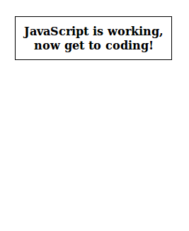







So you want to position items neatly around a circle? Or perhaps you want to make one item rotate around a central point? Let me introduce you to two magical (and surprisingly simple) lines of code:

```javascript
x = centerX + radius * Math.cos( radianAngle );
y = centerY + radius * Math.sin( radianAngle );
```

With some basic trigonometry under your belt, you could probably derive that code yourself. But if you are reading this, chances are pretty big that...

 1. school was a decade ago and you haven't had a single math lesson since
 2. you haven't learned trigonometry in school yet, but still want to learn programming
 3. you were too interested in the cute boy, girl, or teacher to pay any attention in math class.

No worries, you don't need to understand what those two lines do in order to use them; you are free to blindly copy and paste them into your projects when the need arises.

However, if you, like me, prefer understanding the code you are using, sit tight.


### Understanding the Radian Angle

First let us look at the `radianAngle` property. If you want to use degrees, you first need to convert the angle to radians, however, [I would very much recommend learning how to use radians properly](TODO).

```javascript
// Pick one. I prefer the first line, but then you need to make sure `TAU` is defined
radianAngle = degreeAngle * (Math.TAU / 360);
radianAngle = degreeAngle * (Math.PI / 180);
```

Here is an example of the function in action, where you can adjust the `radianAngle` property and see the result:

<div class="tutorial-example">
	<canvas class="ufo-demo" id="ufo-demo-radianAngle" width="500" height="600">
		If you can see this message, your browser does not support canvas, and needs an upate. Sorry. :(
	</canvas>
</div>

Notice that at 0.0 radians, the item points to the right, not straight upwards!

Small inconsistencies like this can occurr when the 2D plane used on the HTML5 canvas or the Flash display list is used slightly differently than the cartesian 2D plane used by mathematicians. Who is to blame for this inconsistency? I do not know, but likely they are long dead by now (serves them right).

Luckily, we can account for this easily by subtracting `1/4 TAU raidans` (which is `1.5708 radians` or `90 degrees`) from our angle if the need arises. But before you use this code, test to see if it is actually needed (it may or may not be required depending on where you are getting your `radianAngle` from).

```javascript
x = centerX + radius * Math.cos( radianAngle - (1/4 * Math.TAU) );
y = centerY + radius * Math.sin( radianAngle - (1/4 * Math.TAU) );
```


### Understanding the center and the radius

These two are fairly straightforward. The center is the X and Y location around which all the items are positioned around, in pixels. The radius is how far from that center you want the items located, this too in pixels.

Here you can test out these values. You can adjust the `centerX` and `centerY` values by moving the mouse around, and adjust the `radius` value with the mouse wheel (or by pressing `+` and `-` on your keyboard, if you don't have a mousewheel):

 +++ DEMO
 
_**Side note:** Notice what happens if you set the radius to a negative value._

### Splitting up items evenly


If your page doesn't look like this, double check that you loaded in the JavaScript properly.






